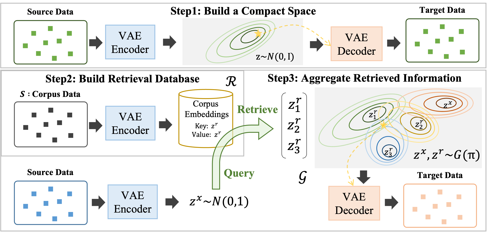

# RegaVAE
This is the official repo for our [paper](https://arxiv.org/abs/2310.10567): 
> RegaVAE: A Retrieval-Augmented Gaussian Mixture Variational Auto-Encoder for Language Modeling

## Model Architecture

Architecture of RegaVAE. Based on the training data, we first train a VAE to construct a compact latent space, which ensures that the latent variable z contains both current and future information (see § 3.1 of the paper). We then build a retrieval database and then aggregate the retrieved information into the generator (see § 3.2 of the paper). VAE Encoder and Decoder parameters are the same in all steps. In order to ensure fairness, the Corpus data and the Source data in the training set are the same. $G$ represents the Gaussian mixture distribution, and $π$ is the corresponding parameter.
